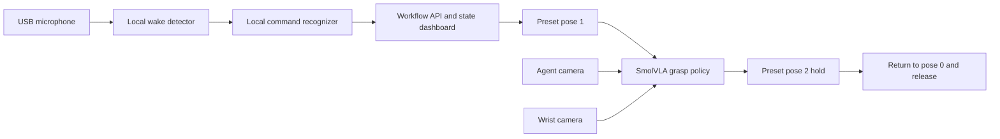

# Rudi: Voice-Triggered SO-101 Water-Grasping Demo

Rudi is a real-robot voice interaction pipeline for an SO-101 arm. The system listens locally for the wake phrase **"HEY RUDI"**, waits for a water-related command, then runs a trained SmolVLA policy to grasp a cup or bottle and deliver it through a fixed preset-pose workflow.

This repository is organized so that another student or reviewer can understand the demo, reproduce the robot-side software, and turn the project into an academic poster.

## What This Project Does

The final workflow is:

1. Move the robot to preset pose 0, the safe start position.
2. Continuously listen through a USB microphone.
3. Detect the local wake phrase: `HEY RUDI`.
4. Record the following command window and require the word `water`.
5. Trigger the robot only after a water command is accepted.
6. Move to preset pose 1, matching the camera viewpoint used during training.
7. Run the trained SmolVLA grasp policy.
8. Move slowly to preset pose 2 while keeping the gripper closed.
9. Hold for 15 seconds.
10. Return to preset pose 0 and release the gripper.

## System Architecture



## Repository Layout

- `src/voice_arm/`: original Gemini Live voice-arm prototype and mock arm interface.
- `voice_control/scripts/`: real robot scripts for recording, preset poses, SmolVLA inference, wake-word control, and the dashboard API.
- `voice_control/data/`: preset pose JSON files and small camera reference images.
- `voice_control/configs/`: training config references used while preparing SmolVLA data.
- `voice_control/docs/`: troubleshooting and robot-operation notes.
- `lerobot_patches/`: local LeRobot compatibility patch used on the robot machine.
- `docs/academic_poster_material.md`: poster-ready project summary, figure plan, and suggested layout.

Large binary artifacts are intentionally excluded from git:

- trained model weights such as `model.safetensors`
- `pretrained_model/` and `pretrained_model_ready/`
- recorded robot datasets and evaluation videos
- local Python virtual environments
- Vosk model binaries

## Robot-Side Requirements

The tested robot-side workspace used:

- Linux desktop
- SO-101 follower arm
- USB leader/follower ports such as `/dev/ttyACM0` and `/dev/ttyACM1`
- two OpenCV cameras: `agent` and `wrist`
- USB microphone
- LeRobot environment with SmolVLA support
- trained SmolVLA model directory available locally
- Vosk small English model for local speech recognition

The local wake/command path does not require committing any cloud API key.

## Setup

The original `voice_arm` package can be installed with:

```bash
sudo apt install -y portaudio19-dev libportaudio2
python -m venv .venv
source .venv/bin/activate
pip install -e ".[dev]"
```

For the real SO-101 workflow, run inside the main LeRobot workspace where `lerobot` and the robot virtual environment are installed.

Download the Vosk model and place it here:

```bash
voice_control/models/vosk-model-small-en-us-0.15
```

Place the trained SmolVLA model directory on the robot machine, for example:

```bash
/home/ima/Desktop/ITR_LeRobot/pretrained_model_ready
```

## Apply Local LeRobot Patch

If using a fresh LeRobot checkout, apply the local compatibility patch:

```bash
cd /home/ima/Desktop/ITR_LeRobot/lerobot
git apply /path/to/voice_arm/lerobot_patches/local_lerobot_changes.patch
```

This patch documents the local changes used for camera handling, policy feature renaming, stats loading, and robot disconnect behavior.

## Run the Full Voice-to-Grasp Demo

From the main LeRobot workspace:

```bash
cd /home/ima/Desktop/ITR_LeRobot
source .venv/bin/activate

python voice_control/scripts/voice_api_grasp_workflow.py \
  --model-path /home/ima/Desktop/ITR_LeRobot/pretrained_model_ready \
  --device cpu \
  --robot-port /dev/ttyACM0 \
  --agent-camera /dev/v4l/by-path/pci-0000:00:14.0-usb-0:6:1.0-video-index0 \
  --wrist-camera /dev/v4l/by-path/pci-0000:00:14.0-usb-0:5.1:1.0-video-index0 \
  --command-provider local \
  --require-water-word \
  --no-accept-speech-after-wake
```

Open the live status dashboard:

```text
http://127.0.0.1:8800
```

The dashboard shows whether the system is idle, listening for wake, recording the command, running the grasp policy, holding at pose 2, or returning to pose 0.

## Dataset and Training Notes

The grasp policy was trained from demonstrations recorded with both camera views:

- `observation.images.agent`
- `observation.images.wrist`

For SmolVLA compatibility, the training/evaluation pipeline maps them to:

- `observation.images.camera1`
- `observation.images.camera2`

The model was trained from demonstrations that begin with the robot already at preset pose 1, so the runtime pipeline first moves to pose 1 before starting VLA inference.

## Poster Materials

Use `docs/academic_poster_material.md` as the starting point for a poster. It includes:

- suggested title and abstract
- motivation and problem statement
- contribution list
- system diagram description
- demo protocol
- evaluation metrics to report
- limitations and future work

## Safety Notes

- Keep the physical workspace clear before running the policy.
- Start each run from pose 0.
- Confirm the wrist camera is attached firmly before inference.
- The post-grasp transfer is intentionally slowed down and keeps the gripper closed to avoid dropping the object.
- On shutdown, the workflow attempts to return to pose 0 and release.

